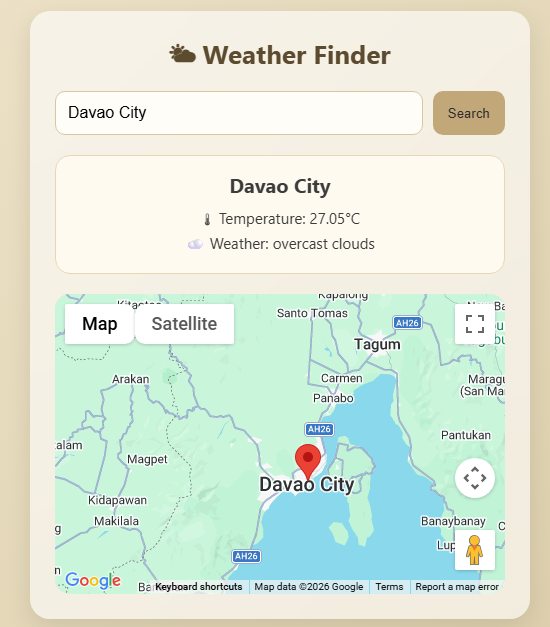

# 🌤 Weather & Map Finder

## 📌 Description
Weather & Map Finder is a simple web application that allows users to search for a city and view its current weather conditions along with its location displayed on a map. It integrates real-time data from external APIs to provide accurate and up-to-date information.

---

## ✨ Features
- 🔍 Search weather by city name  
- 🌡 Displays temperature in Celsius  
- ☁️ Shows weather description  
- 🗺 Displays location using Google Maps  
- 📍 Dynamic map marker for searched city  
- ⚠️ Handles invalid input and errors  
- 📱 Responsive and modern UI design  

---

## 📸 Screenshot of Output

---

## 🔌 API Used
- 🌦 OpenWeather API – for weather data  
- 🗺 Google Maps JavaScript API – for map display  

---

## 👤 Author
**Your Name Here**
